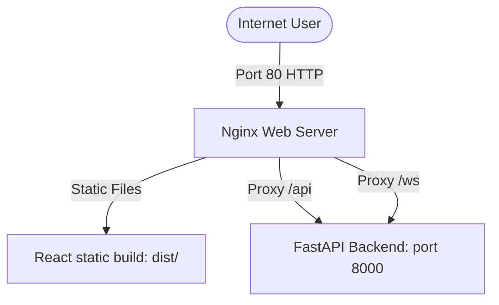

# Deploying Aiquant to AWS EC2 (Simple & Production-Ready)

This guide provides a step-by-step walkthrough to deploy **Aiquant** to an AWS EC2 instance and expose it to the internet using a clean, production-ready Nginx reverse proxy architecture.

---

## 🏗️ Architecture Overview

For a reliable production deployment, we avoid running development servers in the cloud. Instead, we use:
1. **Nginx** (listening on Port `80`): Serves the compiled, static React frontend files directly and routes API/WebSocket requests to the backend.
2. **FastAPI / Uvicorn** (listening on Port `8000` internally): Handled in the background as a system service.



---

## 1. 🚀 Launching your AWS EC2 Instance

1. Log into your **AWS Management Console** and navigate to **EC2**.
2. Click **Launch Instance** and configure:
   * **Name**: `Aiquant-Server` (or similar)
   * **Amazon Machine Image (AMI)**: **Ubuntu 22.04 LTS** (64-bit, x86)
   * **Instance Type**: `t2.micro` or `t3.micro` (Free Tier eligible)
   * **Key Pair**: Create or select an existing `.pem` key pair for SSH access.
3. **Configure Security Group (Firewall)**:
   Add the following inbound rules:
   * **SSH** (Port `22`) -> Source: `My IP` (recommended) or `Anywhere`
   * **HTTP** (Port `80`) -> Source: `Anywhere` (0.0.0.0/0)
   * **HTTPS** (Port `443`) -> Source: `Anywhere` (optional, for SSL)
4. Click **Launch Instance**.

---

## 2. 🔌 Connect and Install Dependencies

Connect to your instance using SSH:
```bash
ssh -i /path/to/your-key.pem ubuntu@YOUR_EC2_PUBLIC_IP
```

Once connected, run the following commands to update packages and install system dependencies:
```bash
# Update package lists
sudo apt update && sudo apt upgrade -y

# Install git, Python 3, venv, Nginx, Node.js & npm
sudo apt install -y git python3-pip python3-venv nginx

# Install NodeSource Node.js LTS (Vite requires Node.js >= 18)
curl -fsSL https://deb.nodesource.com/setup_20.x | sudo -E bash -
sudo apt install -y nodejs
```

Verify your installations:
```bash
python3 --version
node -v
npm -v
nginx -v
```

---

## 3. 📂 Clone the Project and Set Up Backend

Clone your repository onto the server:
```bash
# Clone the repository
git clone <YOUR_GIT_REPOSITORY_URL> Aiquant
cd Aiquant
```

### Configure the Environment Variables
Create a `.env` file in the `backend/` directory to store your API credentials and keys securely:
```bash
nano backend/.env
```
Paste your keys and configure settings:
```ini
ALPACA_KEY_ID=your_alpaca_key_id
ALPACA_SECRET_KEY=your_alpaca_secret_key
# Add other credentials as needed
```
Press `Ctrl+O` then `Enter` to save, and `Ctrl+X` to exit nano.

### Create Virtual Environment and Install Dependencies
```bash
cd backend
python3 -m venv venv
source venv/bin/activate
pip install --upgrade pip
pip install -r requirements.txt
```

### Run Backend as a Systemd Service (Autostarts on reboot/crash)
Create a service file:
```bash
sudo nano /etc/systemd/system/aiquant-backend.service
```
Paste the following configuration:
```ini
[Unit]
Description=Aiquant FastAPI Backend Service
After=network.target

[Service]
User=ubuntu
WorkingDirectory=/home/ubuntu/Aiquant/backend
ExecStart=/home/ubuntu/Aiquant/backend/venv/bin/uvicorn main:app --host 127.0.0.1 --port 8000
Restart=always

[Install]
WantedBy=multi-user.target
```
Save and exit.

Start and enable the service:
```bash
sudo systemctl daemon-reload
sudo systemctl start aiquant-backend
sudo systemctl enable aiquant-backend
```
Check status to ensure it is running successfully:
```bash
sudo systemctl status aiquant-backend
```

---

## 4. 💻 Build the Frontend

Vite compiles code to static production assets in the `dist/` directory.

```bash
cd /home/ubuntu/Aiquant/frontend
npm install
npm run build
```
This compiles your frontend files into `/home/ubuntu/Aiquant/frontend/dist`.

---

## 5. 🌐 Configure Nginx Web Server

Nginx will serve the static React frontend files directly and reverse-proxy any request to `/api` or `/ws` to the backend.

Open the default Nginx configuration:
```bash
sudo nano /etc/nginx/sites-available/default
```

Replace its contents entirely with the following configuration:
```nginx
server {
    listen 80 default_server;
    listen [::]:80 default_server;

    server_name _;

    # Serve the Vite compiled static frontend assets
    root /home/ubuntu/Aiquant/frontend/dist;
    index index.html;

    location / {
        try_files $uri $uri/ /index.html;
    }

    # Proxy REST API requests to the FastAPI Backend
    location /api {
        proxy_pass http://127.0.0.1:8000;
        proxy_set_header Host $host;
        proxy_set_header X-Real-IP $remote_addr;
        proxy_set_header X-Forwarded-For $proxy_add_x_forwarded_for;
        proxy_set_header X-Forwarded-Proto $scheme;
    }

    # Proxy WebSocket connections to the FastAPI Backend
    location /ws {
        proxy_pass http://127.0.0.1:8000;
        proxy_http_version 1.1;
        proxy_set_header Upgrade $http_upgrade;
        proxy_set_header Connection "Upgrade";
        proxy_set_header Host $host;
        proxy_set_header X-Real-IP $remote_addr;
        proxy_set_header X-Forwarded-For $proxy_add_x_forwarded_for;
        proxy_set_header X-Forwarded-Proto $scheme;
    }
}
```
Save and exit.

Test the Nginx config for syntax errors:
```bash
sudo nginx -t
```
Restart Nginx to apply changes:
```bash
sudo systemctl restart nginx
```

---

## 6. 🎉 Verification

Open a web browser and navigate to your **EC2 Public IPv4 address** or your configured domain name:
`http://YOUR_EC2_PUBLIC_IP`

The landing page and strategy dashboard should load instantly, fetching statistics and processing data in real time!

### Troubleshooting Service Logs
If anything doesn't work as expected, view logs for your services using:
```bash
# View backend service output/logs
sudo journalctl -u aiquant-backend.service -n 100 -f

# View Nginx access/error logs
sudo tail -f /var/log/nginx/error.log
```
